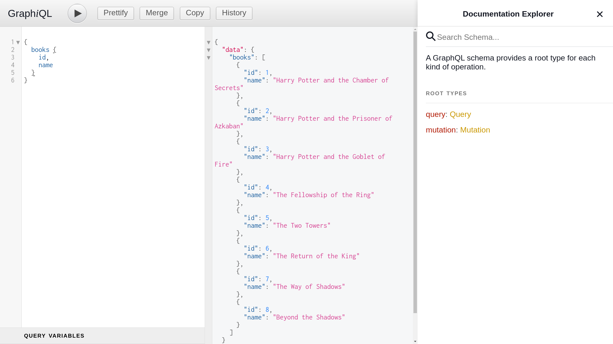

# First NodeJS GraphQL

Good example for starter and learning GraphQL + NodeJS easily and fastly. (Just in 10 minutes)

If you would like to read more, you can check out official documentation at [here](https://graphql.org/graphql-js/running-an-express-graphql-server/).

## Examples

#### List of all books id and name
```
{
  books {
    id,
    name
  }

}
```



#### List of authors and their books

```
{
  authors {
    id
    name
    books {
      name
    }
  }
}
```


## Similar Repository

- https://github.com/BaseMax/first-nodejs-apollo-graphql/

### References

- https://graphql.org/graphql-js/running-an-express-graphql-server
- https://github.com/graphql/express-graphql

---------

# Max Base

My nickname is Max, Programming language developer, Full-stack programmer. I love computer scientists, researchers, and compilers. ([Max Base](https://maxbase.org/))

## Asrez Team

A team includes some programmer, developer, designer, researcher(s) especially Max Base.

[Asrez Team](https://www.asrez.com/)
