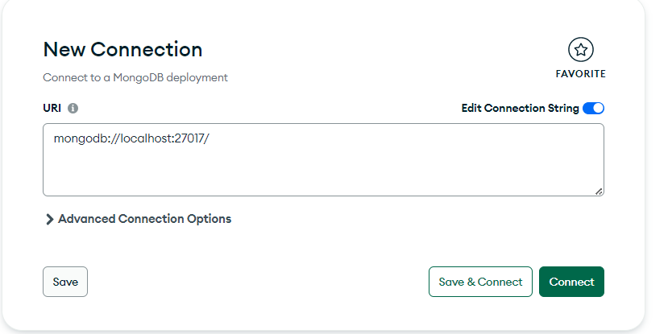
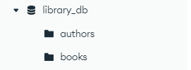
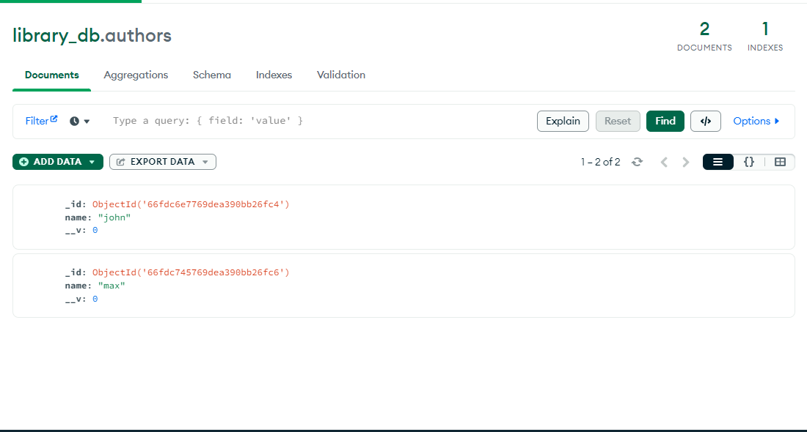
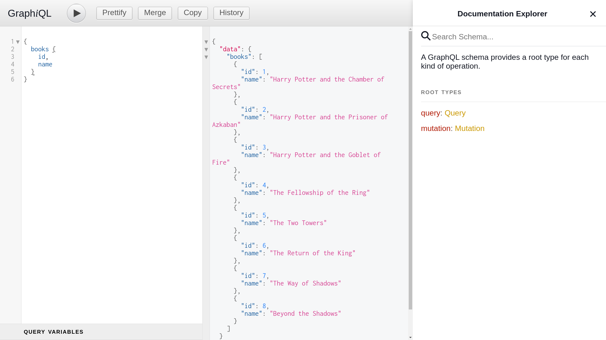
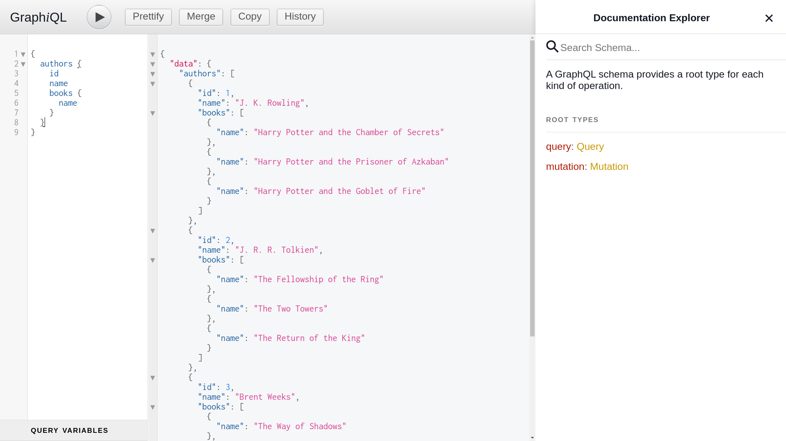
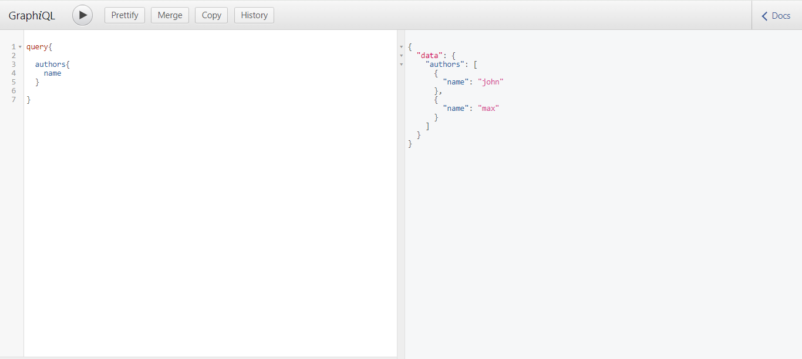
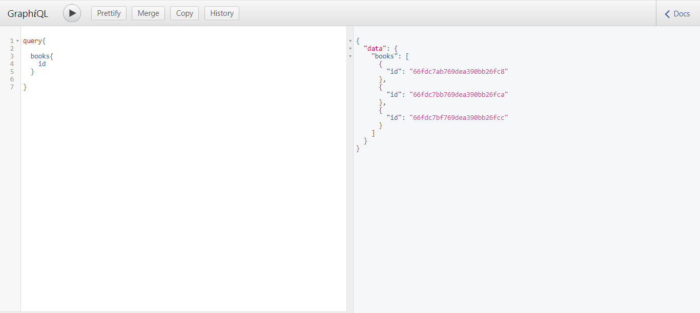
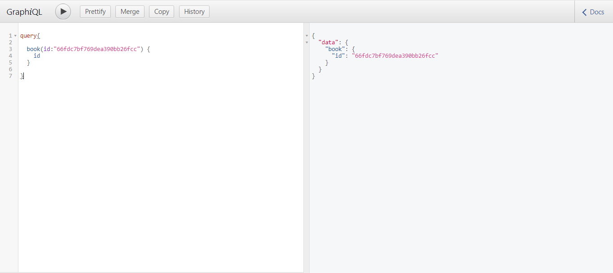
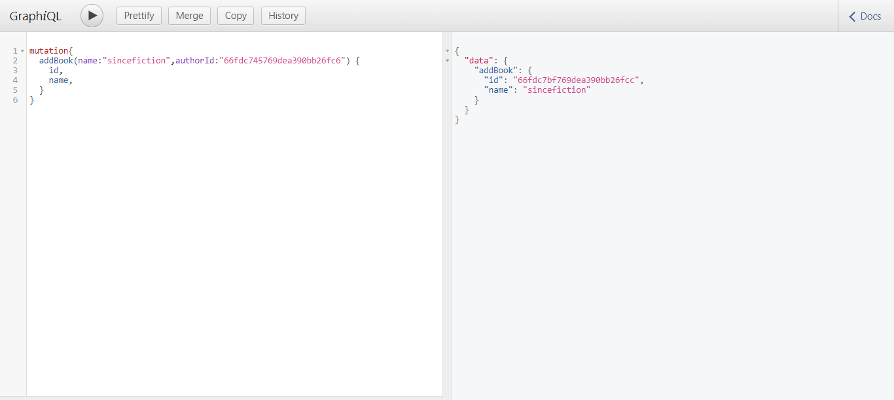
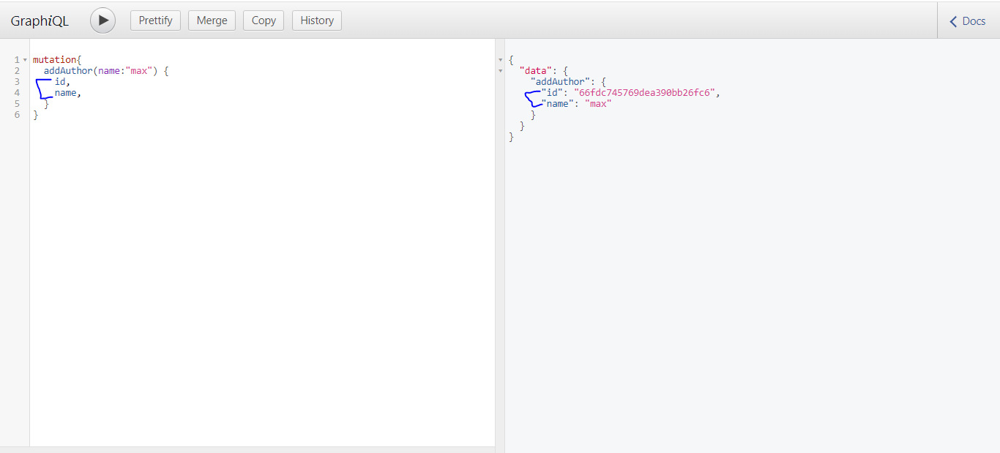

# First NodeJS GraphQL

Good example for starter and learning GraphQL + NodeJS easily and fastly. (Just in 10 minutes)

If you would like to read more, you can check out official documentation at [here](https://graphql.org/graphql-js/running-an-express-graphql-server/).

## Using

```
$ yarn install
$ yarn start
```

- Download MongoDB Compass and install from [here](https://www.mongodb.com/try/download/compass).

 Once MongoDB Compass is installed, you can open it to view your host and port details.

- Make sure to update your database configuration in `config/.env` to match your MongoDB setup.

## images of MongoCompass

- Below are some images showcasing MongoDB Compass to help you get familiar with the interface.








Then open: `http://localhost:5000/graphql/?query=%7B%0A%20%20books%20%7B%0A%20%20%20%20id%2C%0A%20%20%20%20name%0A%20%20%7D%0A%0A%7D`

## Examples

#### List of all books id and name
```
{
  books {
    id,
    name
  }
}
```



#### List of authors and their books

```
{
  authors {
    id
    name
    books {
      name
    }
  }
}
```




#### List of authors name

```
{
  authors {
    name
  }
}
```




#### List of books id

```graphql
{
  books {
    id
  }
}
```




#### Get a Single Book by args(Id)

```graphql
{
  book(id:"66fdc7ab769dea390bb26fc8") {
    name
  }
}
```




#### Add book by name and authorId

```graphql
{
  mutation{
    addBook(name:"sincefiction",authorId:"66fdc6e7769dea390bb26fc4"){
    id,
    name
    }
  }
}
```




#### Add author by name

```graphql
{
  mutation{
    addAuthor(name:"max"){
    id,
    name
    }
  }
}
```




## Similar Repository

- https://github.com/BaseMax/first-nodejs-apollo-graphql/

### References

- https://graphql.org/graphql-js/running-an-express-graphql-server
- https://github.com/graphql/express-graphql
- https://www.youtube.com/watch?v=n1mdAPFq2Os
- https://www.youtube.com/watch?v=YBydg_Ui02Q
- https://www.youtube.com/watch?v=ZQL7tL2S0oQ

---------

# Max Base

My nickname is Max, Programming language developer, Full-stack programmer. I love computer scientists, researchers, and compilers. ([Max Base](https://maxbase.org/))

## Asrez Team

A team includes some programmer, developer, designer, researcher(s) especially Max Base.

[Asrez Team](https://www.asrez.com/)
